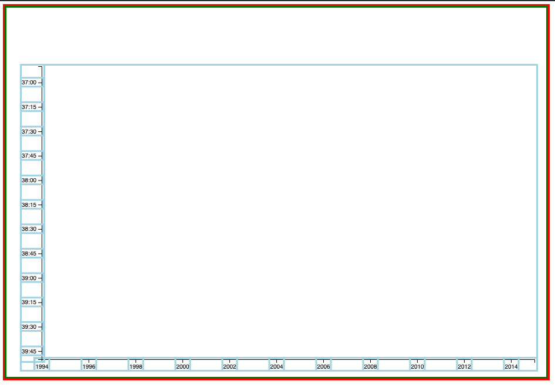

# FCC Data Visulaization Projects
## d3 Scatterplot
---

### Elements Plot
1. Append svg canvas into body
2. Set svg width and height including margins for the graph.
3. Append group(g) to svg 
4. Translate group's origin by margin.left and margin.top to match the origin of the chart.
5. Store the group element into <code>svg</code> varibale.

This makes it easier to place x and y axis, not needing to translate them separately. You only need to translate the container group and bring down the x-axis by the height of the graph.

```javascript
  /* define svg canvas */
const svg = d3.select('body').append('svg')
  .attr('width', width + margin.left + margin.right)
  .attr('height', height + margin.top + margin.bottom)
  .attr('class', 'graph') 
  .append('g') // append <g> for graph and translate origin
  .attr('transform', 'translate(' + margin.left +',' + margin.top + ')');
.
.
.
svg.append('g').call(xAxis)
      .attr('id', 'x-axis')
      .attr('transform', 'translate(0,' + height + ')')
    
    svg.append('g').call(yAxis)
      .attr('id', 'y-axis')
```

```css
.graph {
  border: 3px solid green;
}

svg {
  outline: 3px solid red;

}

.graph g {
  outline: 3px solid lightBlue;
}
```


### SVG Group Element
Group Element &lt;g&gt; is a container used to group other SVG element. 
You can set transform attribute on group element to move its nested element.
Note: You are setting `x` and `y` attr on the **child element**, not the container element(&lt;g&gt;).
```javascript
/* legend */
      const legend = svg.selectAll('.legend')
        .data(colorScale.domain())
        .enter().append('g')
        .attr('id', 'legend')
        .attr('class', 'legend')
        .attr('transform', (d, i) => {
          return `translate(0, ${height/2 - i * 20})`;
        })
      
      legend.append('rect')
        .attr('x', width - 18)
        .attr('height', 18)
        .attr('width', 18)
        .style('fill', colorScale);

      legend.append('text')
        .attr('x', width - 24)
        .attr('text-anchor', 'end') // aligns the end of text to the x-coord and baseline to y-coord
        .attr('y', 15)
        .text(d => d ? "Riders with doping allegations" :
        "No doping allegations")
        .style('font-size', '12px');
  ```      

### d3.scaleOrdinal([[domain,]range])
Just like `d3.scaleLinear`, `d3.scaleOrdinal` takes range as an argument when provided with only one. When there are two arguments fed into the scales, first one becomes the domain.
But unlike `scaleLinear` whose range will default to [0, 1] without setting it explicitely, `scaleOrdinal` will have an empty array as its range when you don't specify it.
In addition, when you call the scale function returned from `d3.scaleOrdinal`, you can pass in a domain value to output a corresponding value from the range. If the input value was not found in the domain, it will be pushed into the domain array, and you will get the "next" value from the range array.
Next time you input the same value that was just added to the domain, the same corresponding value from the range will be returned.

```javascript
const colorScale = d3.scaleOrdinal(d3.schemeCategory10);
.
.
.
.style('fill', d => colorScale(d.Doping != '')) // push true(1) or false(0) to the domain
// will output two corresponding values from the range(one for each).
.
.
.
.data(colorScale.domain()) 
// will return [true, false]
// creating selections (array) of two elements (appended `<g>`)
// from which we can build legend icons
```
`colorScale.domain()` returns values that is connected to corresponding color scheme from the range.
We can retreive only the colors that were actually used for domain vlues so that we can create a legend explaining what those colors imply.

